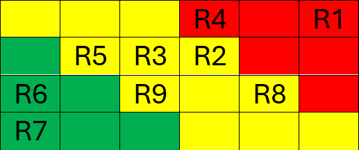

# Contrôle de Qualité

## Introduction
Une immersion interactive dans une serre portable comportant des projections et du mapping vidéo sur les parois, accompagnée de musique d'ambiance et de sons immersifs.  

Les participants sont invités à s'approcher d'une boule lumineuse. En déplaçant la boule, **ça** déclenche un visuel unique. 

Thème de l’interconnexion entre l'humain et la nature et transformation. 

## Produit Minimum Viable
Pour que le projet fonctionne, il nous faut au minimum: 

- Un environnement renfermé (ex: tempo ou serre portative) 

- Une toile sombre (pour éviter les interférences provenant de l’extérieur) 

- Trois projecteurs  

- Deux haut-parleurs accompagnés d’une carte de son 

- 1 sphère  

- Bandes LED  

- Support de la sphère (ex: haut tabouret) 

- 1 ordinateur 

### Matériel de base

### Visuel
En veille: Il y aura une boucle d’animation projetée par les 3 projecteurs en tout temps afin d’inviter les visiteurs dans l’environnement. Les projections ressembleraient à des structures de natures abstraites contenues dans un encadrement similaire à des fenêtres.

### Son
En veille: Une musique d’ambiance en boucle. Un son paisible et harmonieux avec la joie occupera la pièce même lorsque les visiteurs rentreront dans la salle. De plus, on tient à ajouter en surplus sur notre son d’ambiance. Minimalement des bruits d’oiseaux et de vent qui viennent s’ajouter aléatoirement.

### Interactivité
Lorsque le(s) visiteur(s) roulent la boule, les animations en veille se modifient au rythme et en direction du mouvement afin de rendre évident le contrôle de l’utilisateur sur l’environnement qui l’entoure. Petit à petit, les animations différentes finissent par s’agrandir et se fusionner avec l’espace vide qui les entourait afin de submerger les parois avec les animations.

## Lien Répertoire GitHub
https://github.com/tprangers/internature.git 

**Livraison des tests (date) : Le 31 janvier 2025**

## Matrice des risques

**R1** : Les animations risquent de ne pas être visibles et ou déformées/mauvaises qualités sur toutes les surfaces en raison de la configuration des projecteurs. (Valider la qualité du mapping). 

**R2** : Risque que le **"”** ait de la difficulté à détecter le mouvement de la sphère. 

**R3** : Positionnement et place des haut-parleurs/projecteurs limités à cause de la serre. 

**R4** : Peu de connaissances sur le **"”** et sa communication dans Arduino et sur le mapping vidéo. 

**R5** : La toile laisse passer de la lumière et il y a de la pollution de lumière. 

**R6** : Au contraire, qu’il fasse trop noir dans la pièce et qu’on ait besoin d’ajouter des lampes. 

**R7** : Une personne de plus de 7 pieds et ou plusieurs personnes entrent en même temps et il n’y a pas de place. (Taille limitée) 

**R8** : La taille de la serre ne fonctionne pas avec l’espace du studio et le plan de notre projet. 

**R9** : La qualité, stabilité et durabilité de la serre ne convient pas. 

### Probabilité VS impact

Lors des premières semaines, nous devons effectuer des tests de mapping avec l’emplacement de nos projecteurs et avec le logiciel virtuel pour s’assurer que la qualité des médias projetés par les projecteurs soit passable. Si jamais nos hypothèses ne sont pas faisables, on va devoir changer leur emplacement afin d’atteindre la meilleure qualité de projection possible. **(R1)**

Pour les risques reliés au matériel, nous devons effectuer plusieurs recherches et plusieurs tests avec le module Arduino qu’on va choisir pour créer notre interaction (un gyroscope) puisqu’on manque de connaissances à propos de ce matériel spécifique et on est incertain de sa capacité de détection et de sa communication avec les logiciels qu’on va utiliser. **(R4, R2)**

Pour les risques reliés à la pollution extérieure, notre équipe va effectuer des tests de projection avec l’équipement qui serait présent durant la présentation finale (ex: lumières ambiantes du grand studio) afin d’ajuster la luminosité à l’intérieur de la serre selon la visibilité des projections et de l’environnement durant le parcours. (R6) On devra également effectuer des tests avec des toiles noires et d’autres équipements de lumières afin de simuler la luminosité extérieure qui pourrait affecter nos médias projetés à l’intérieur. **(R5)**

Pour s’assurer que le confort à l’intérieur de notre pièce satisfait le plus grand nombre de visiteurs possible, notre équipe va tester la pièce selon chaque variété de visiteurs possible, comme la possibilité d’avoir quelqu’un de plus grand que la norme ou un grand groupe d’amis. Selon nos résultats, il va falloir apporter des changements dans l’emplacement ou des panneaux qui avertissent les visiteurs des contraintes. **(R7)**

Dépendamment des installations des autres, il va falloir tester l’emplacement donné à notre équipe et vérifier si tout l’équipement rentre dans le grand studio. Nous devrons ajuster la proximité et la hauteur des haut-parleurs, afin d’assurer la qualité du son et de sa sonorisation en stéréo. C'est la même procédure qu’on devrait apporter à l’installation des projecteurs. (R3) De plus, il va falloir installer la serre et prendre en compte sa taille dans le studio afin de décider son emplacement parfait selon le reste des projets. **(R8)**

Selon la qualité de notre serre, notre équipe effectuera des tests liés à sa stabilité et sa durabilité afin de s’assurer que l’installation n’est pas fragile et qu’elle soit sécuritaire pour les visiteurs.  **(R9)**

## Tests à réaliser
___
### Scénario 1

#### Scénario
L’interacteur entre dans la zone de détection et voit plusieurs petites projections en mapping. Lors de son entrée, la musique d’ambiance et des animations minimes sont déclenchées pour accueillir immédiatement l’interacteur dans un milieu invitant.

#### Identification
**Cas de test 1.1** Projections interactives déclenchées sans interaction avec la boule.

#### Priorité
Faible

#### Date limite
Semaine 1-2

#### Description
##### Décrire le but du test, les caractéristiques de l’environnement du test et le principe de réalisation du test.
S’assurer qu’il y a une projection interactive par défaut affichée sur les fenêtres de la serre quand l’interacteur entre dans l’espace et n’a pas encore touché à la boule.

#### Contraintes
##### Décrire les contraintes liées à ce scénario (Environnement de test particulier, installation particulière, intervention humaine spécifique, …)
Bien configurer le LIDAR et les Kinects. Faire le lien entre les détecteurs et les projecteurs.

#### Dépendances
##### Lister et expliciter les tests à mener préalablement à la réalisation du scénario.
- S’assurer de la programmation et communication avec les logiciels Arduino et Touch Designer.
- S’assurer que les Kinects LIDAR et le projecteur communiquent ensemble pour détecter la présence d’une personne dans la serre et l’interaction.

#### Procédure de test
- **Données d’entrée :** Animation en forme de fenêtres
- **Résultats attendus :** Mapping et projection des fenêtres et plantes et de l’interactivité lorsque l’on passe devant. 
- **Critères de validation :** On voit l’animation et elle change lorsqu’on passe devant.

#### Résultat
...

#### Identification
**Cas de test 1.2** Musique d’ambiance et sons spatialisés déclenchés lorsque l’interacteur entre dans la serre.

#### Priorité
Faible

#### Date limite
Semaine 1-2

#### Description
##### Décrire le but du test, les caractéristiques de l’environnement du test et le principe de réalisation du test.
S’assurer que l’ambiance musicale de base joue dès que l’interacteur entre dans l’espace. 

#### Contraintes
##### Décrire les contraintes liées à ce scénario (Environnement de test particulier, installation particulière, intervention humaine spécifique, …)
Le volume devra être modifié selon les installations avoisinantes.

#### Dépendances
##### Lister et expliciter les tests à mener préalablement à la réalisation du scénario.
- Placer les haut-parleurs de façon à optimiser l’expérience.  
- S’assurer d’avoir bien configuré le détecteur de mouvement pour qu’il y ait une détection lorsque quelqu’un entre dans la serre.

#### Procédure de test
- **Données d’entrée :** Musique spatialisée et sons spatialisés.
- **Résultats attendus :** Musique d’ambiance et sons joués lorsque l’interacteur entre dans la serre.
- **Critères de validation :** Le son sort comme prévu dans chaque haut-parleur.

#### Résultat
...
___

### Scénario 2

#### Scénario
L’interacteur fait des mouvements de mains sur les projections sur les parois afin d’apporter des changements dans leurs animations.

#### Identification
**Cas de test 2.1** Projections interactives se modifient selon le mouvement des mains de l’interacteur.

#### Priorité
Faible

#### Date limite
Semaine 1-2

#### Description
##### Décrire le but du test, les caractéristiques de l’environnement du test et le principe de réalisation du test.
S’assurer que les détecteurs capturent bien le mouvement des mains de l’interacteur dans la zone définie et que les projections se modifient selon celui-ci.

#### Contraintes
##### Décrire les contraintes liées à ce scénario (Environnement de test particulier, installation particulière, intervention humaine spécifique, …)
Bien configurer le LIDAR et les Kinects. Faire le lien entre les détecteurs et les projecteurs. 

#### Dépendances
##### Lister et expliciter les tests à mener préalablement à la réalisation du scénario.
- S’assurer de la programmation et communication avec les logiciels Arduino et Touch Designer.
- S’assurer que les Kinects LIDAR et le projecteur communiquent ensemble pour détecter l’interaction de l’interacteur. 

#### Procédure de test
- **Données d’entrée :** Animation en forme de fenêtres.
- **Résultats attendus :** Interactivité des projections lorsque l’utilisateur est assez proche de la zone de détection.  
- **Critères de validation :** On voit l’animation et elle change lorsqu’on passe devant.

#### Résultat
...

#### Identification
**Cas de test 2.2** Sons spatialisés en appui lorsque l’utilisateur interagit avec une ou plusieurs projections.

#### Priorité
Faible

#### Date limite
Semaine 1-2

#### Description
##### Décrire le but du test, les caractéristiques de l’environnement du test et le principe de réalisation du test.
S’assurer que selon les animations dans les projections, ça active des sons relatifs dans la spatialisation de l’environnement.

#### Contraintes
##### Décrire les contraintes liées à ce scénario (Environnement de test particulier, installation particulière, intervention humaine spécifique, …)
Le volume devra être modifié selon les installations avoisinantes et s’assurer que les sons jouent dans les plusieurs haut-parleurs en random.

#### Dépendances
##### Lister et expliciter les tests à mener préalablement à la réalisation du scénario.
- Placer les petits haut-parleurs de façon à optimiser l’expérience.
- S’assurer d’avoir bien configuré le détecteur de mouvement pour qu’il y ait une détection lorsque quelqu’un interagit avec une ou plusieurs projections des fenêtres.

#### Procédure de test
- **Données d’entrée :** Sons spatialisés et détection de l’interactivité selon la zone de projection.
- **Résultats attendus :** Sons joués lorsque l’interacteur interagit.
- **Critères de validation :** Critères de validation : Le son sort comme prévu dans chaque haut-parleur.

#### Résultat
...
___
### Scénario 3

#### Scénario
L’interacteur interagit avec la boule.

#### Identification
**Cas de test 3.1** Projection déclenchée par l'interaction avec la boule.

#### Priorité
Haute

#### Date limite
Semaine 2-3

#### Description
##### Décrire le but du test, les caractéristiques de l’environnement du test et le principe de réalisation du test.
S’assurer qu’il y a une projection affichée sur les parois de la serre quand l’interacteur touche à la boule et la fait tourner.

#### Contraintes
##### Décrire les contraintes liées à ce scénario (Environnement de test particulier, installation particulière, intervention humaine spécifique, …)
Bien configurer le détecteur de mouvement sous la boule. Faire le lien entre le détecteur et les projecteurs.

#### Dépendances
##### Lister et expliciter les tests à mener préalablement à la réalisation du scénario.
- S’assurer de la programmation et communication avec les logiciels Arduino et Touch Designer.
- S’assurer que le détecteur de distance et le projecteur communiquent ensemble. 

#### Procédure de test
- **Données d’entrée :** Animation parois.
- **Résultats attendus :** Mapping et projection sur les parois de la serre.
- **Critères de validation :** On voit l’animation.

#### Résultat
...

#### Identification
**Cas de test 3.2** Musique d’ambiance et sons spatialisés jouent lorsque l’interacteur tourne la boule.

#### Priorité
Haute

#### Date limite
Semaine 2-3

#### Description
##### Décrire le but du test, les caractéristiques de l’environnement du test et le principe de réalisation du test.
S’assurer que l’ambiance musicale de base joue et que les sons sont modifiés quand l’interacteur tourne la boule.

#### Contraintes
##### Décrire les contraintes liées à ce scénario (Environnement de test particulier, installation particulière, intervention humaine spécifique, …)
Le volume devra être modifié selon les installations avoisinantes.

#### Dépendances
##### Lister et expliciter les tests à mener préalablement à la réalisation du scénario.
- Placer les haut-parleurs de façon à optimiser l’expérience.
- Bien configurer le détecteur de mouvement sous la boule. Faire le lien entre le détecteur et les haut-parleurs. 

#### Procédure de test
- **Données d’entrée :** Musique spatialisée et sons spatialisés.
- **Résultats attendus :** Musique d’ambiance et sons joués lorsque l’interacteur entre dans la serre.
- **Critères de validation :** Le son sort comme prévu dans chaque haut-parleur.

#### Résultat
...
___

### Scénario 4

#### Scénario
L’interacteur tourne la boule ou interagit avec ses mains sur les parois jusqu’à remplir l’espace de la serre.

#### Identification
**Cas de test 4.1** Détection du mouvement continu sur la boule.

#### Priorité
Moyenne

#### Date limite
Semaine 3-4

#### Description
##### Décrire le but du test, les caractéristiques de l’environnement du test et le principe de réalisation du test.
S’assurer que la projection affichée sur les parois de la serre change quand l’interacteur touche la boule même avec des pauses dans son mouvement jusqu’à remplir la serre.

#### Contraintes
##### Décrire les contraintes liées à ce scénario (Environnement de test particulier, installation particulière, intervention humaine spécifique, …)
S’assurer que la projection change lorsque la serre est remplie, donc jusqu’à un certain seuil.

#### Dépendances
##### Lister et expliciter les tests à mener préalablement à la réalisation du scénario.
- Bien configurer Touch Designer et Mad Mapper pour changer la projection selon le seuil de plantes dans la serre.
- Mettre des limites de temps pour l’activation et l’arrêt de l’animation qui englobe l’espace. 

#### Procédure de test
- **Données d’entrée :** Nouvelle animation sur les projections.
- **Résultats attendus :** Changement visuel des projections.
- **Critères de validation :** Les projections prennent toute l’espace qui leur est attribué.

#### Résultat
...

#### Identification
**Cas de test 4.2** Les sons spatiaux et la musique d’ambiance sont modifiés avec les projections.

#### Priorité
Moyenne

#### Date limite
Semaine 3-4

#### Description
##### Décrire le but du test, les caractéristiques de l’environnement du test et le principe de réalisation du test.
S’assurer que les sons sont complémentaires visuellement et modifiés en même temps que le changement d’animation selon le mouvement de la boule.

#### Contraintes
##### Décrire les contraintes liées à ce scénario (Environnement de test particulier, installation particulière, intervention humaine spécifique, …)
S’assurer que lorsque la projection change, les sons l’accompagnent dans ses changements.

#### Dépendances
##### Lister et expliciter les tests à mener préalablement à la réalisation du scénario.
- Bien configurer Touch Designer et Reaper pour changer les sons selon les changements dans les projections.

#### Procédure de test
- **Données d’entrée :** Détection du mouvement de la boule.
- **Résultats attendus :** Sons spatiaux et musique d’ambiance sont modifiés.
- **Critères de validation :** Les sons suivent le changement des animations visuelles dans les projecteurs.

#### Résultat
...
___

### Scénario 5

#### Scénario
L’interacteur arrête toute interactivité avec l’environnement.

#### Identification
**Cas de test 5.1** Les projections se retirent et les sons changent.

#### Priorité
Moyenne

#### Date limite
Semaine 3-4

#### Description
##### Décrire le but du test, les caractéristiques de l’environnement du test et le principe de réalisation du test.
S’assurer que la projection affichée sur les parois de la serre change lorsque l’intéracteur ne touche ni à la boule et ne fait pas de mouvements sur les parois de la serre.

#### Contraintes
##### Décrire les contraintes liées à ce scénario (Environnement de test particulier, installation particulière, intervention humaine spécifique, …)
La personne doit cesser de toucher aux aspects interactifs.

#### Dépendances
##### Lister et expliciter les tests à mener préalablement à la réalisation du scénario.
Bien configurer Touch Designer et Mad Mapper pour changer la projection lorsqu’il n’y a aucune interaction.

#### Procédure de test
- **Données d’entrée :** Les plantes se rétractent.
- **Résultats attendus :** Les projections changent.
- **Critères de validation :** Les projections changent lorsqu'il n’y a aucune interaction.

#### Résultat
...

#### Identification
**Cas de test 5.2**

#### Priorité

#### Date limite

#### Description
##### Décrire le but du test, les caractéristiques de l’environnement du test et le principe de réalisation du test.

#### Contraintes
##### Décrire les contraintes liées à ce scénario (Environnement de test particulier, installation particulière, intervention humaine spécifique, …)

#### Dépendances
##### Lister et expliciter les tests à mener préalablement à la réalisation du scénario.

#### Procédure de test
- **Données d’entrée :** 
- **Résultats attendus :** 
- **Critères de validation :** 

#### Résultat
...
___

### Scénario 6

#### Scénario
L’interacteur sort de la pièce.

#### Identification
**Cas de test 6.1** S’assurer que les modules LIDAR et Kinect captent la détection de mouvements lorsqu’une personne sort de la serre.

#### Priorité
Haute

#### Date limite
Semaine 3-4

#### Description
##### Décrire le but du test, les caractéristiques de l’environnement du test et le principe de réalisation du test.
S’assurer que le module LIDAR et le Kinect détectent un changement de données lorsqu’une personne sort de la pièce.

#### Contraintes
##### Décrire les contraintes liées à ce scénario (Environnement de test particulier, installation particulière, intervention humaine spécifique, …)
S’assurer que l’emplacement des modules LIDAR et Kinect soit positionné à un endroit qui facilite les détections proches de la sortie.

#### Dépendances
##### Lister et expliciter les tests à mener préalablement à la réalisation du scénario.
- Assurer la sensibilité des modules LIDAR et des Kinect pour capturer toutes les personnes qui entrent et sortent.

#### Procédure de test
- **Données d’entrée :** Détection de présence.
- **Résultats attendus :** Changement de données lors d’une détection.
- **Critères de validation :** Les données changent lorsqu’une personne entre ou sort de la serre.

#### Résultat
...

#### Identification
**Cas de test 6.2** S’assurer que les sons s’arrêtent rapidement après avoir détecté le manque de mouvement dans l’espace.

#### Priorité
Haute

#### Date limite
Semaine 3-4

#### Description
##### Décrire le but du test, les caractéristiques de l’environnement du test et le principe de réalisation du test.
S’assurer que les sons soient réinitialisés pour les prochains interacteurs qui rentrent dans la pièce et qu’ils ne jouent pas sans arrêt malgré le manque de visiteurs afin de ne pas déranger les installations voisines.

#### Contraintes
##### Décrire les contraintes liées à ce scénario (Environnement de test particulier, installation particulière, intervention humaine spécifique, …)
S’assurer que les sons s’arrêtent doucement lorsque le LIDAR et les Kinects arrêtent de détecter un visiteur dans la pièce.

#### Dépendances
##### Lister et expliciter les tests à mener préalablement à la réalisation du scénario.
- Bien configurer Touch Designer et Reaper pour que les sons et la musique s’arrêtent en fondu lorsque le manque de détection se produit.

#### Procédure de test
- **Données d’entrée :** Détection de visiteurs.
- **Résultats attendus :** Déclenchement de l’arrêt des sons et de la musique.
- **Critères de validation :** Le silence rapide dans l’espace vide.

#### Résultat
...

