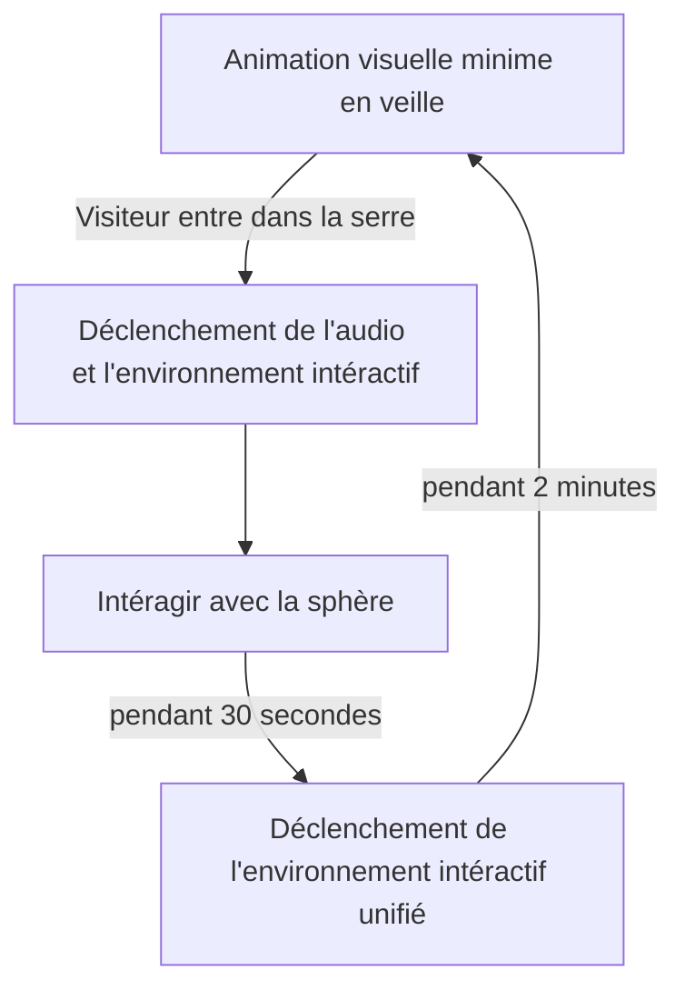
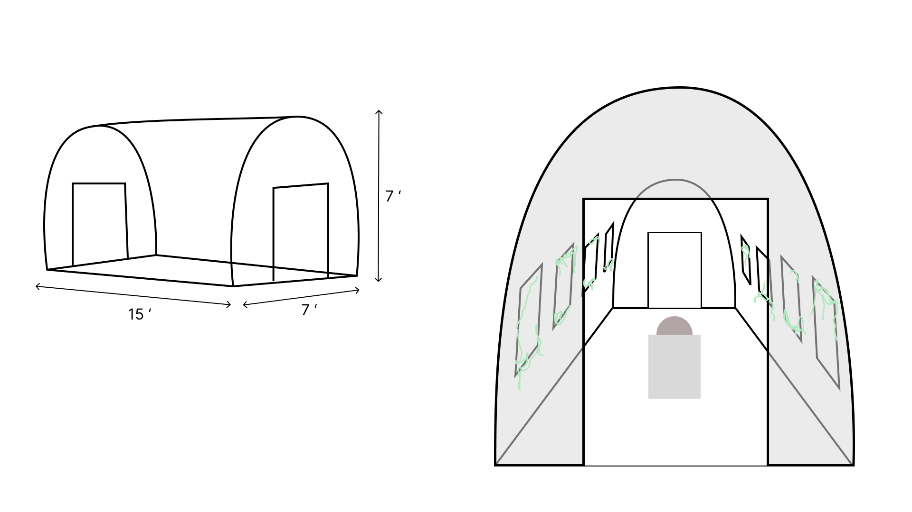
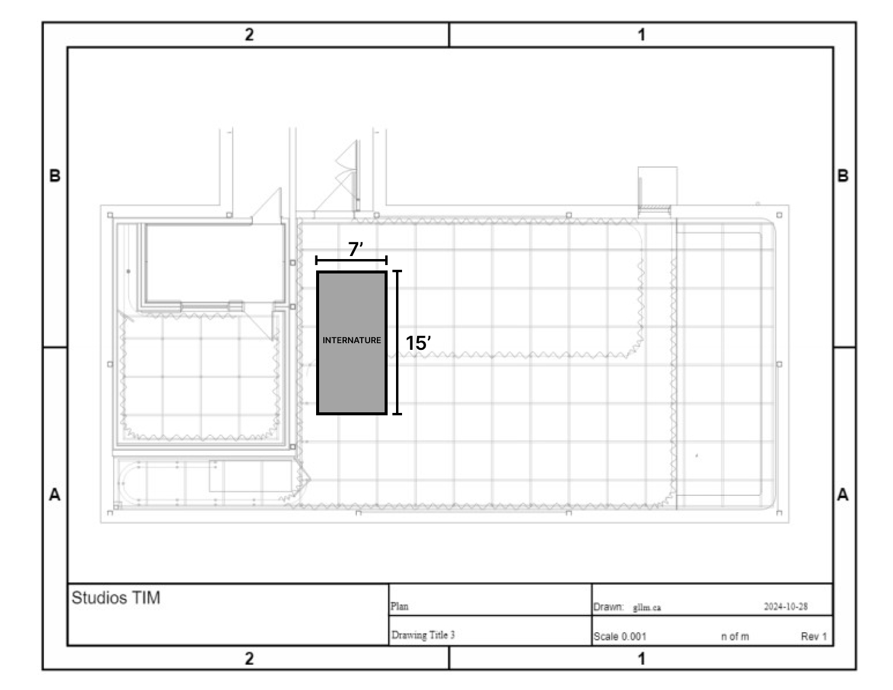
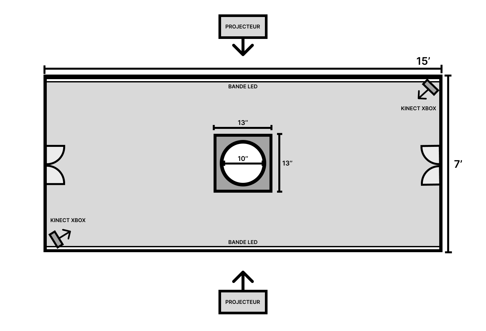

# INTERNATURE
## Concept
Internature est une expérience immersive qui intègre le mapping vidéo sur les parois de notre installation, accompagné par une musique ambiante et des sons immersifs. Au coeur de cet environnement, les visiteurs sont invités à intéragir avec les parois intéractives et une boule lumineuse qui déclenche un spectacle de lumière unifiant toutes les projections. Cette expérience invite les participants à reconnecter avec la nature et à redécouvrir leur lien avec elle de manière unique et émotionnelle.

## Objectif 
Ce projet explore le lien entre l'humain, la technologie et la nature, en questionnant si la technologie peut réellement remplacer la nature. L'interaction se fait en déplaçant la boule représentant notre implication en tant qu'humain sur l'environnement. En fonction de ses mouvements, les plantes poussent et prennent progressivement possession de l'espace. Lorsqu'elles occupent l'entièreté de l'espace, un spectacle lumineux qui met en valeur la beauté de la nature se déclenche. 

## Schéma d'intéractivité

## Scénario

1. L'intéracteur entre dans la serre -> Détecteur de mouvement qui allume la projections dans les fenêtres et l'ambiance de base musique
2. L'intéracteur s'avance vers la boule et peut admirer l'oeuvre en état "de veille"
3. L'intéracteur touche à la boule et la tourne -> selon la direction et la vitesse, des projection de plantes grimpent partant du centre vers le haut de la serre. Des bruitages se font entendre.
4. Lorsque la majorité de la serre a de la projection, il y a un spectable de couleur avec une musique.
5. L'intéracteur peut toujours jouer avec la boule et modifier le spectacle
6. Après 45 secondes, le spectacle s'arrête et les plantes raptissent 
7. L'oeuvre tombe en veille.. bruit de respiration.. comme si l'oeuvre reprend son souffle. Aucune intéraction, cela invite l'intéracteur à quitter la serre
8. Après 30 secondes, projection sur les fenêtres et mapping de plantes
9. Si aucune intéraction, fermeture du sons et projections

## Prototype de serre

## Prototype de la sphère

## Schéma Plantation Studio

## Schéma de connexions 

Mad Mapper
OSC bridge
Touch Designer
Arduino
Reaper

## Matériel Requis
- Ordinateur x1
- Projecteur (Tests à faire)x3
- Haut-parleur Genelec x2 
- Haut-parleur Dvoom x10
- Boule semi-transparente x1
- Support pour la boule x1
- Berring à bille x4
- Serre portative x1 
- PMW3360 Motion Sensor x1
- Module LIDAR x2
- Kinect XBOX x2
- Bandes lumineuses LED x2

## Sources
### Recherche Technique
- [Faire des tests de mouvement - Berrings](https://youtu.be/VbxcjOQlUPA?si=PVR5ewIHE-6zU1Ci&t=27)
- [Utiliser PMW3360 Motion Sensor](https://www.youtube.com/watch?v=CSA7Ih7nAls)
- [Vidéo mapping dans touch designer](https://www.youtube.com/watch?v=mTH7ZB4x47Q)

### Matériel
- [Serre](https://www.amazon.ca/portable-galvanis%C3%A9-sup%C3%A9rieures-diagonaux-enroulables/dp/B0D8KQLJKN/ref=sr_1_3_sspa?crid=2TCDEG8L2V37W&dib=eyJ2IjoiMSJ9.B9dkS9qJ4UP0glIJoNKfQfubm9D9_JpV4kwmr-b9QMy_pFipM3myhuM8AGfqy0UCzOLmRVjzzKrIt6XvA_FCsEVtyxqiWqjRNqZdfcVFX1NGWZkyTCtgESnQjziIa5mWrQCDEeCcg1GblIrf32Z8QpQxs0hifJ8Jx19wUkwSnMlPh8LfF3fSiQl9htVVMUOhGmjbnTmvfn9qJgUujgEZBlOYyN4ZC5I1i2Ur0qT8kC7ZIeOL6UrO_rjYAe__2r-WXkgGeM1Sx5p48_hQJ8Pafxawq2VdRhveNh1WOB4kT-Q.h8swQdtDTEyr1g5o8Cz7PfF4CAVuGXehVrnHWS3JJ-s&dib_tag=se&keywords=walk%2Bin%2Btunnel%2Bgreenhouse&qid=1731963509&sprefix=walk%2Bin%2Btunnel%2Bgre%2Caps%2C62&sr=8-3-spons&sp_csd=d2lkZ2V0TmFtZT1zcF9hdGY&th=1)
- [Berrings à bille](Statics.teams.cdn.office.net/evergreen-assets/safelinks/1/atp-safelinks.html)
- [PMW3360 Motion Sensor](https://lectronz.com/products/pmw3360-motion-sensor)

## Gestion d'équipe
### Rôles
#### Delphine (Programmeur)
- Programmation Arduino 
- Programmation TouchDesigner
- Programmation Mapping Vidéo
- Programmation Mapping Sonore

#### Kenza (Conceptrice)
- Conceptrice sonore
- Conceptrice vidéo
- Programmation Mapping

#### Khaly (AQ et Mascotte)
- S'assurer du bien-être de tous
- S'assurer de l'assurance qualité
- Aide à la programmation
- Aide conception
- Programmation Mapping Vidéo
- Programmation Mapping Sonore
  
#### Sitmonternna (Scrummaster & PO)
- S'arrurer des délais et que les tâches soient fait
- Aide à la programmation
- Aide conception
- Programmation Mapping Vidéo
- Programmation Mapping Sonore

### Motivations
#### Delphine
- Utilisation de nouvelles technologies et l'apprentissage de celles-ci
- Voir le produit final
#### Kenza
- Avoir une liberté artistique
- L'objectif me parle
- Voir le produit final

#### Khaly
- L'objectif me parle
- L'ambiance visuelle est inspirante

#### Sitmonternna
- Voir le produit final
- Travailler sur un gros projet multimédia

### Échéancier 

