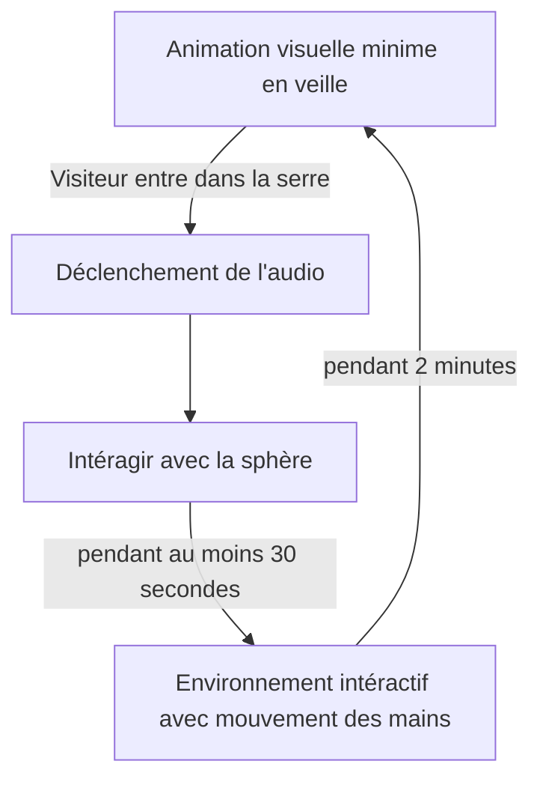

# INTERNATURE
## Concept: 
Une immersion interactive dans une arche comportant des projections et du mapping vidéo sur les parois, accompagnée de musique d'ambiance et de sons immersifs.
 
Les participants sont invités à s'approcher d'une boule lumineuse. En déplaçant la boule, ça déclenche un visuel unique. 
 
## Objectif : 
L'interacteur déplace une boule représentant une source d'énergie centrale. En fonction de ses mouvements, les plantes poussent et prennent progressivement possession de la serre, comme une plante qui grandit selon la direction du soleil. Lorsqu'elles atteignent leur pleine croissance, un spectacle lumineux et coloré se déclenche. Ce projet explore le lien entre l'humain, la technologie et la nature, en questionnant si la technologie peut réellement remplacer la nature.
 
## Thèmes:
- Interconnexion entre l'humain et la nature
- Transformation

## Schéma d'intéractivité

## Scénario

1. L'intéracteur entre dans la serre -> Détecteur de mouvement qui allume la projections dans les fenêtres et l'ambiance de base musique
2. L'intéracteur s'avance vers la boule et peut admirer l'oeuvre en état "de veille"
3. L'intéracteur touche à la boule et la tourne -> selon la direction et la vitesse, des projection de plantes grimpent partant du centre vers le haut de la serre. Des bruitages se font entendre.
4. Lorsque la majorité de la serre a de la projection, il y a un spectable de couleur avec une musique.
5. L'intéracteur peut toujours jouer avec la boule et modifier le spectacle
6. Après 45 secondes, le spectacle s'arrête et les plantes raptissent 
7. L'oeuvre tombe en veille.. bruit de respiration.. comme si l'oeuvre reprend son souffle. Aucune intéraction, cela invite l'intéracteur à quitter la serre
8. Après 30 secondes, projection sur les fenêtres et mapping de plantes
9. Si aucune intéraction, fermeture du sons et projections

## Prototype de serre

## Prototype de la sphère

## Schéma Plantation Studio

## Schéma de connexions 

Mad Mapper
OSC bridge
Touch Designer
Arduino
Reaper

## Matériel Requis
- Ordinateur x1
- Projecteur (Tests à faire)x3
- Haut-parleur Genelec x2 
- Haut-parleur Dvoom x10
- Boule semi-transparente x1
- Support pour la boule x1
- Berring à bille x4
- Serre portative x1 
- PMW3360 Motion Sensor x1
- Module LIDAR x2
- Bandes lumineuses LED x2

## Sources
### Recherche Technique
- [Faire des tests de mouvement - Berrings](https://youtu.be/VbxcjOQlUPA?si=PVR5ewIHE-6zU1Ci&t=27)
- [Utiliser PMW3360 Motion Sensor](https://www.youtube.com/watch?v=CSA7Ih7nAls)
- [Vidéo mapping dans touch designer](https://www.youtube.com/watch?v=mTH7ZB4x47Q)

### Matériel
- [Serre](https://www.amazon.ca/portable-galvanis%C3%A9-sup%C3%A9rieures-diagonaux-enroulables/dp/B0D8KQLJKN/ref=sr_1_3_sspa?crid=2TCDEG8L2V37W&dib=eyJ2IjoiMSJ9.B9dkS9qJ4UP0glIJoNKfQfubm9D9_JpV4kwmr-b9QMy_pFipM3myhuM8AGfqy0UCzOLmRVjzzKrIt6XvA_FCsEVtyxqiWqjRNqZdfcVFX1NGWZkyTCtgESnQjziIa5mWrQCDEeCcg1GblIrf32Z8QpQxs0hifJ8Jx19wUkwSnMlPh8LfF3fSiQl9htVVMUOhGmjbnTmvfn9qJgUujgEZBlOYyN4ZC5I1i2Ur0qT8kC7ZIeOL6UrO_rjYAe__2r-WXkgGeM1Sx5p48_hQJ8Pafxawq2VdRhveNh1WOB4kT-Q.h8swQdtDTEyr1g5o8Cz7PfF4CAVuGXehVrnHWS3JJ-s&dib_tag=se&keywords=walk%2Bin%2Btunnel%2Bgreenhouse&qid=1731963509&sprefix=walk%2Bin%2Btunnel%2Bgre%2Caps%2C62&sr=8-3-spons&sp_csd=d2lkZ2V0TmFtZT1zcF9hdGY&th=1)
- [Berrings à bille](Statics.teams.cdn.office.net/evergreen-assets/safelinks/1/atp-safelinks.html)
- [PMW3360 Motion Sensor](https://lectronz.com/products/pmw3360-motion-sensor)

