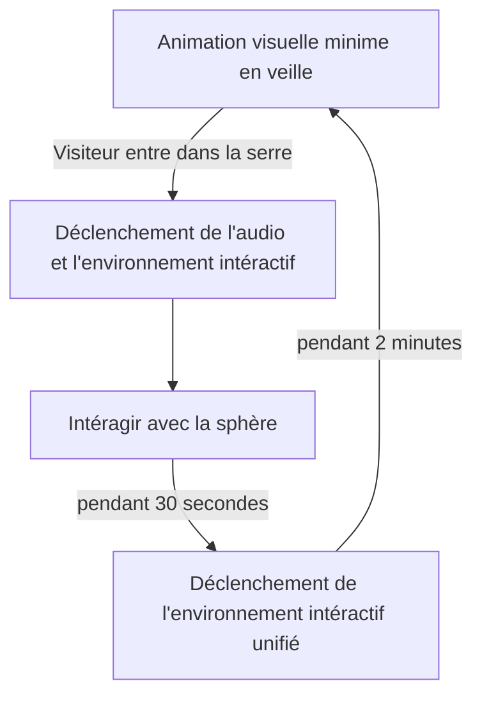

## Scénario

## Schéma d'intéractivité

```mermaid
flowchart TD
    A[Animation visuelle minime et volume en pause: état de veille] -->|Visiteur entre dans la serre| B[Déclenchement de l'audio et l'environnement intéractif]
    B --> C[Intéragir avec la sphère]
    C -->|pendant 30 secondes| D[Déclenchement de l'environnement intéractif unifié] 
    D --> |pendant 2 minutes| A[Animation visuelle minime en veille]
```

## Scénario

