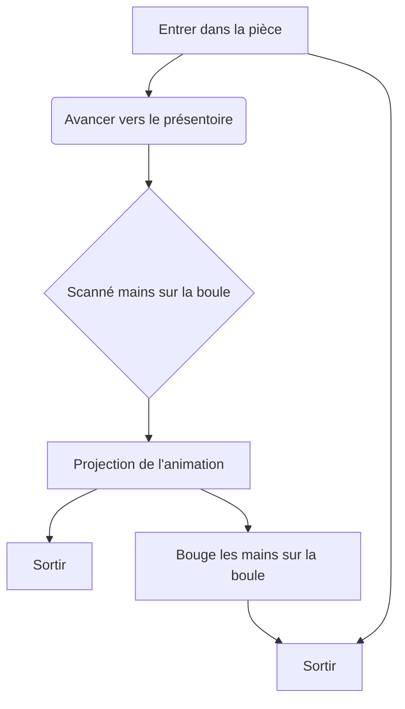

# Internature

## Idée générale
### Concept
Une immersion intéractive faite à l'aide de l'intelligence artificielle dans un dome accompagnée de musique et décoration lumineuse.

### Objectif
Ce projet vise à offrir aux visiteurs une interaction humaine enrichie par la technologie. Il s’agit également d’une activité conviviale pouvant rassembler de larges groupes, favorisant ainsi le renforcement des liens humains grâce à l’innovation technologique.

### Motivation créative
Ce projet a pour objectif de rassembler les proches tout en démontrant en intéragissant avec une boule lumineuse .

### Logigramme de l'intéractivité

 

### Plantation 

### Narratif
Il n' y a pas de trame narrative, le projet est une immersion intéractive dans un dome.

### Expérience de l' utilisateur
#### Installation de la Boule Interactif 
Les participants sont invités à s'approcher d'une boule lumineuse. En plaçant leurs mains dessus, elle déclenche un visuel unique.

#### Scanne 
La boule scannera leur battement de coeur, leur biométrie ainsi que leur température afin de personnaliser leur animation la boule émettera une lumière pour indiquer son processus.

#### Visualisation de l'Énergie 
À mesure qu'ils interagissent avec la boule, une animation générée par l’intelligence artificielle est projetter sur toute la pièce et les lumières changeront de couleurs aussi, représentant leur énergie sous forme de couleurs et  formes abstraites. Chaque interaction est différente, rendant chaque expérience personnelle et unique.

#### Intéractivité avec la boule
À mesure que les visiteurs bouge leur mains l' animation bougera et les couleurs de lumières changeront aussi.

## Besoins matériels et logiciels
### Liste des équipements
Mini Heart Rate Unit (MAX30100) Pulse Oximeter x1
 
Ordinateur x1 
 
Lumière en forme de chandelles x12
 
Projecteur x3
 
Haut-parleur x2
 
Boule semi-transpararente x1
 
Capteur de température et d'humidité numérique x1
 
Lecteur d'empreinte digital

### Logiciels et réseaux
Mad mapper
 
Osc bridge
 
Touch Designer
 
Arduino
 
Reaper

